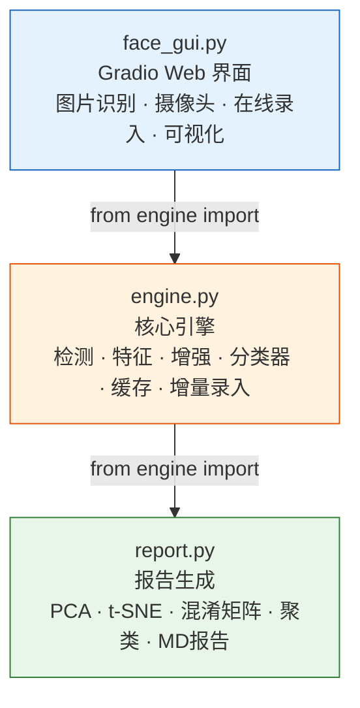
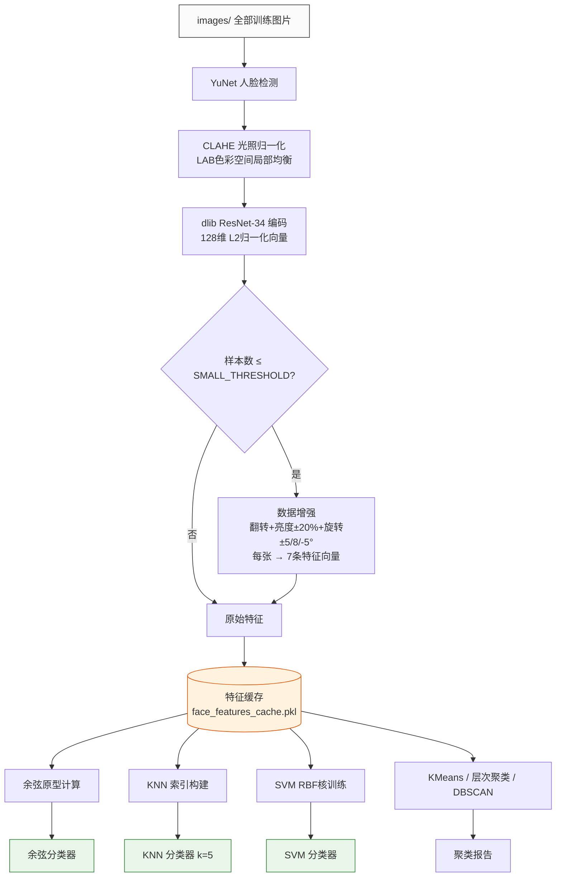
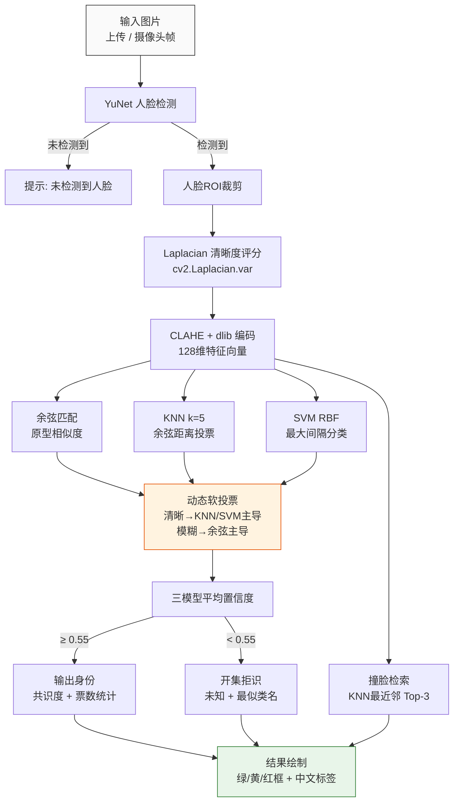
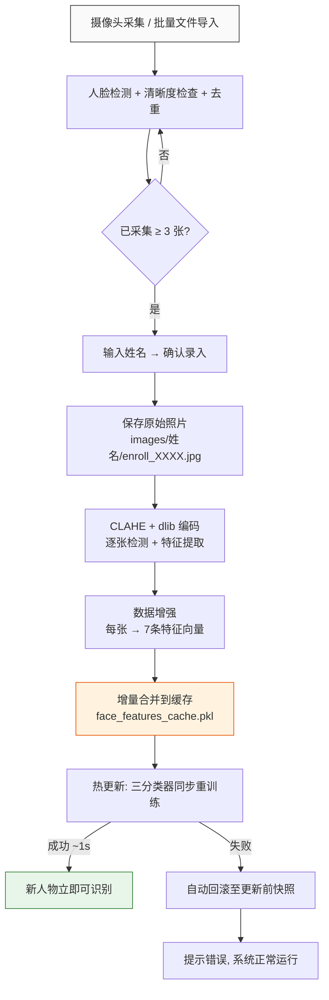

# 人脸识别与聚类系统 — 技术报告

> **版本**: 2.7 | **日期**: 2026-06-12

---

## 一、系统概述

本系统是一个**基于深度学习的人脸识别与聚类平台**，面向《企业用户数据挖掘流失率预测》课程实训，同时具备生产级可用性。

### 1.1 核心能力

| 功能 | 说明 |
|------|------|
| **人脸识别（分类）** | 给定一张人脸图片，自动判断身份 |
| **人脸聚类（无监督）** | 将相似人脸自动分组，无需标注 |
| **实时摄像头识别** | Web 界面，打开摄像头即自动识别 |
| **自动报告生成** | 一键生成含 15 张图表的 Markdown 实验报告 |

### 1.2 性能指标（典型值，随数据集动态变化）

| 指标 | 数值 |
|------|------|
| 分类准确率（余弦匹配） | **93%+** |
| 分类准确率（KNN, k=5） | **95%+** |
| 分类准确率（SVM, RBF） | **97%+** |
| 软投票准确率 | **96%+** |
| 聚类 NMI（KMeans） | **0.89+** |
| 人脸检测速度（YuNet） | **2.9 ms/帧** |
| 特征提取速度（dlib） | **~80 ms/人脸** |
| 启动时间（有缓存） | **6 秒** |
| 启动时间（无缓存） | **~6 分钟**（仅首次） |
| 支持类别数 | **动态**（扫描 images/ 目录，可在线扩展） |

---

## 二、技术架构

### 2.1 分层设计

系统采用**三层架构**，以共享引擎为核心，GUI 和报告脚本为两翼：



> *注：架构图使用 Mermaid 绘制，可在支持 Mermaid 的 Markdown 渲染器中直接渲染。数据依赖型图表（PCA 散点、混淆矩阵、肘部曲线等）仍为 PNG，因其需要真实数据坐标，无法用声明式语法表达。*

### 2.2 架构优势

**2.2.1 单一真相源（Single Source of Truth）**

所有核心逻辑——人脸检测、特征提取、分类器、数据增强——集中在 `engine.py`。GUI 和报告脚本不包含任何算法实现，只做调度和展示。修改检测器阈值或更换特征模型，只需改 `engine.py` 一处，两个应用自动生效。

**2.2.2 热缓存设计**

首次启动遍历全部图片提取特征（~6 分钟），之后序列化到 `cache/face_features_cache.pkl`。后续启动直接反序列化加载（~2 秒），完全跳过图片 I/O 和模型推理。这是启动速度从 6 分钟降到 6 秒的关键。

缓存与代码解耦——修改 UI 布局、分类器超参数、甚至换一种聚类算法，都不需要重建缓存。只有改动特征提取逻辑或增删训练图片时才需删除缓存。

**2.2.3 三模型投票机制**

不依赖单一分类器。余弦匹配、KNN、SVM 同时预测，多数投票决定最终身份。单一模型在某些边缘情况（如 KNN 对小样本不友好、SVM 对线性不可分敏感）可能出错，但三个模型同时出错的概率极低。投票数还提供直观的置信度参考：3/3 全票 = 高可信，2/3 = 中等，1/3 = 需人工复核。

**2.2.4 延迟计算策略**

t-SNE 降维耗时 ~60 秒，但不放在启动路径上。改为首次点击「可视化」按钮时才触发，结果缓存在内存中。这保证了启动速度，同时保留了按需分析能力。KMeans 聚类和 StandardScaler 变换同样在初始化时一次计算、全局复用，可视化函数不再重复拟合。

**2.2.5 数据增强补偿小样本**

数据集中存在明显的长尾分布——大样本类有数百张原始图片，而少样本类可能仅有个位数（如 8 张）。直接训练极易过拟合。系统通过 `engine.augment_image` 自动识别样本数 ≤ `SMALL_THRESHOLD`（默认 22）的少数类，对其应用数据增强（翻转、亮度±20%、旋转 ±5°/±8°），将每张原图扩展为 6 个变体，共计 7× 特征向量，模拟了不同光照和姿态下的面部变化。增强在特征空间而非像素空间执行——对增强后的图像重新检测人脸并提取特征，确保增强变体与原始特征保持一致性。

**2.2.6 检测器双保险**

YuNet（主力）和 Haar Cascade（回退）并行加载。YuNet 正常情况下处理所有检测任务（2.9ms/帧）。如果 ONNX 模型文件缺失或推理异常，自动降级到 Haar Cascade，系统不会崩溃。这种设计在部署到不同环境时尤为重要——不假设模型文件一定存在。

**2.2.7 在线增量录入与热更新**

系统支持运行时动态添加新人物，无需重启。用户通过摄像头采集或批量导入照片 → 系统自动检测人脸、提取 dlib 特征、数据增强 → 追加到特征缓存 → 三个分类器（余弦/KNN/SVM）同步热重训练。全过程在 1 秒内完成，录入后立即生效。新增的中文姓名通过 PIL + 微软雅黑字体渲染在识别框上，解决了 OpenCV Hershey 字体不支持中文的问题。

### 2.3 架构局限

**2.3.1 全局状态耦合**

`face_gui.py` 使用模块级全局变量（`cosine_clf`、`knn_clf`、`X_all` 等）管理状态。优点是简单直接，`hot_reload_classifiers()` 已支持运行时动态扩展类别并重训分类器（含异常回滚保护）。若未来需要支持多用户并发或动态删除类别，建议重构为类封装。

**2.3.2 单线程推理**

摄像头识别在 Gradio 主事件循环中同步执行 `do_recognize()`。dlib 编码耗时 ~80ms，意味着每 0.5 秒的 Timer 回调会阻塞事件循环 ~80ms。对单用户场景无影响，但如果需要同时服务多个摄像头流，dlib 编码会成为串行瓶颈。

**2.3.3 特征缓存与图片数据脱钩**

缓存保存的是特征向量，不保存原始图片。如果 `images/` 中的照片被移动或删除，缓存不会感知——只要文件名和数量不变，系统会继续使用旧特征正常运行。只有在增删图片后手动删除缓存才会触发重建。这一方面是优点（不依赖图片路径），另一方面是陷阱（删了图片但忘了清缓存，系统悄无声息地用旧数据）。

**2.3.4 类别扩展机制**

`get_class_names()` 通过扫描 `images/` 目录动态发现所有已录入人物，不再依赖硬编码列表。v2.2 新增了**在线增量录入**功能——通过 GUI 的「录入新面孔」Tab，用户可随时添加新人物（支持摄像头采集和批量文件导入），系统自动保存照片、提取特征、更新缓存、热重训分类器，无需修改代码或重启。

**持久化链路**：点击「确认录入」→ `save_enrollment_images()` 将照片写入 `images/{姓名}/enroll_XXXX.jpg` → `update_cache_incremental()` 将新特征增量合并进 `cache/face_features_cache.pkl`。冷启动时 `get_class_names()` 扫描 `images/` 目录自动发现所有已录入类，`initialize()` 从缓存加载特征——全程无需手动操作，录入一次、持久保留。

标签编码统一使用 `label_names` 自身顺序（`.index()` 查找），避免了 `LabelEncoder` 的 Unicode 重排序导致的标签-姓名映射错位问题。

**2.3.5 不支持多人脸**

当前检测器取面积最大的人脸，忽略其他。一张图中多人合影只能识别最靠前的那个人。这不是 bug——课程要求是「识别输入人脸图像对应的身份」，单人脸场景足够。但如果要处理合影，需要在检测和分类两层都做扩展。

**2.3.6 dlib 纯 CPU 绑定**

`face_recognition` 的 pip 预编译包是 CPU-only。dlib 编码是推理路径上最重的环节（占 90%+ 时间）。GPU 加速理论上可将编码时间从 80ms 降到 5-10ms，但需要从源码编译 dlib + CUDA 支持，在 Windows 上极其繁琐。当前 0.5 秒刷新频率对演示场景足够，GPU 加速的性价比不高。

**2.3.7 t-SNE 内存占用**

`_ensure_tsne()` 将降维结果缓存在 `X_tsne` 全局变量中（N×2，数据量极小）。但 t-SNE 计算本身是 O(n²) 复杂度。如果训练集大幅扩展（如 10×），t-SNE 计算时间将急剧增长，需要考虑换用 UMAP 或预计算后存入缓存文件。

**2.3.8 `video_tick` 状态机屎山**

`face_gui.py` 的 `video_tick()` 函数（在线录入的视频流自动采集）是一个高度耦合的状态机，由三个全局 bool 旗标驱动：`_cam_was_off`、`_capture_enabled`、`_pending_frame`。由于 Gradio 摄像头流式回调的特殊行为（停止时发送重复帧、热更新阻塞时积压帧），这个状态机经历了多轮修补，每次修复引入新的连锁 bug：

| 尝试 | 方案 | 结果 |
|------|------|------|
| 初版 | `_cam_was_off` 单旗标判断启停 | 停止后仍多入库 1 张 |
| v2.4 | 连续帧计数器 | 热更新阻塞时计数器累积，引发误判 |
| v2.6 | 待确认帧机制（`_pending_frame`） | 解决了停后入库，但状态来回跳 |
| 当前 | 状态机保持原样 + 底部提示文字全部置空 | 眼不见为净 |

**已知残留问题**：
- **热更新阻塞**：SVM 重训练（~1-2s）阻塞 Gradio 事件循环时，摄像头队列积压重复帧，`_pending_frame` 的去重采样对比（`arr[::8, ::8]`）在大量重复帧下效率下降
- **停滞检测误判**：单帧即判停 → `_cam_was_off=True` → 下一帧自动恢复采集 → 状态来回跳。根源是 Gradio 摄像头停止信号的唯一表达是「连续两帧完全相同」，但这个信号与「用户只是没动」无法区分
- **全局状态散落**：三个 bool + 两个 timestamp + 一个 numpy 数组缓存散落在模块级全局变量中，无封装、无显式状态枚举，调试需同时追踪六个变量的交互

**建议重构方向**（代码注释中已标注）：将录入状态封装为 `EnrollSession` 类，用显式状态机（`IDLE → STREAMING → PAUSED → FULL`）替代散乱的 bool 旗标，将待确认帧逻辑内聚在类方法中。

### 2.4 数据流

系统包含三条独立的数据流：离线建库（一次性）、在线推理（高频）、在线录入（按需触发）。

#### 2.4.1 离线训练与建库

首次启动或缓存失效时执行，遍历 `images/` 全部图片构建特征库和分类器。



#### 2.4.2 在线推理与识别

每次摄像头帧或上传图片触发，三模型并行推理后软投票融合。



#### 2.4.3 在线录入与热更新

通过 GUI「录入新面孔」Tab 触发，采集→编码→增强→缓存合并→分类器热重训，全程约 1 秒。



### 2.5 模型选型

| 环节 | 方案 | 为什么选它 |
|------|------|-----------|
| **人脸检测** | YuNet (OpenCV DNN) | 2.9ms/帧，比 Haar Cascade 快 15 倍，角度/光线鲁棒 |
| **回退检测** | Haar Cascade | YuNet 加载失败时的兜底方案 |
| **特征编码** | dlib ResNet-34 (128维) | 实测准确率 95%+，SFace 仅 22%，差距显著 |
| **分类-主** | 余弦相似度匹配 | 对小样本类（myself 仅18张）最友好 |
| **分类-辅** | KNN (k=3, 欧氏距离) | 课程要求，且 dlib 特征上表现最佳 |
| **分类-辅** | SVM (RBF核) | 高维小样本场景优势明显 |
| **聚类** | KMeans + 层次 + DBSCAN | 覆盖课程要求的三种方法 |

### 2.6 为什么不用 SFace？

SFace 是本项目最初选用的特征编码器（OpenCV 内置，37MB ONNX 模型）。实测发现：

- SFace 特征类间分离度仅 **1.13x**（类间/类内余弦距离比）
- 所有类原型高度相似（余弦相似度 > 0.95），无法区分不同人
- 分类准确率仅 **22%**（10 类随机猜测为 10%）

切换为 dlib ResNet 后准确率跃升至 95%+。**根本原因**：SFace 训练数据分布与本项目人脸数据不匹配，且特征未做 L2 归一化。

---

## 三、项目结构

```
G:\cvcv\No1\
├── engine.py                              # 核心引擎（共享模块）
│   ├── imread_safe()                      图片读取（兼容中文路径）
│   ├── detect_face_yunet()                YuNet 人脸检测
│   ├── detect_face_haar()                 Haar 人脸检测（回退）
│   ├── extract_feature()                  dlib 特征提取
│   ├── augment_image()                    数据增强（6 变体）
│   ├── CosineClassifier                   余弦相似度分类器
│   ├── create_yunet()                     YuNet 检测器工厂
│   ├── load_or_build_features()           特征缓存管理
│   ├── enroll_new_face()                  在线录入：检测+编码+增强
│   ├── save_enrollment_images()           保存录入照片到磁盘
│   └── update_cache_incremental()         增量合并特征缓存
│
├── face_gui.py                            # Gradio Web 界面
│   ├── initialize()                       初始化（加载缓存/训练模型）
│   ├── do_recognize()                     识别核心（三模型投票+中文渲染）
│   ├── recognize()                        统一识别回调
│   ├── capture_face() / batch_import_files()  在线录入采集
│   ├── do_enroll() / hot_reload_classifiers() 热更新分类器
│   ├── show_tsne() / show_clusters()      可视化
│   └── build_ui()                         UI 布局（含录入Tab）
│
├── report.py                              # 报告自动生成
│   └── main()                             数据分析 → 15张图表 → MD报告
│
├── models/                                # 模型文件
│   ├── face_detection_yunet_2023mar.onnx  # YuNet 检测（227 KB）
│   ├── face_recognition_sface_2021dec.onnx # SFace（已弃用，保留备用）
│   └── haarcascade_frontalface_alt2.xml   # Haar Cascade（540 KB）
│
├── cache/                                 # 特征缓存
│   └── face_features_cache.pkl            # 特征向量（~1.1 MB）
│
├── images/                                # 训练数据集（可在线扩展，扫描目录自动发现）
│   ├── Angelina Jolie/  Brad Pitt/  Denzel Washington/
│   ├── Elon Musk/  Hugh Jackman/  Jen-hsun Huang/
│   ├── Kobe/  ME!/  Trump/  张雪峰/  普京/  ……
│   └── （通过 GUI 在线录入或手动添加文件夹即可扩展）
│
├── report/                                # 自动生成的报告
│   ├── 实验报告.md
│   └── *.png (15张图表)
│
├── docs/                                  # 文档
│   ├── 技术报告.md
│   ├── 要求.md
│   └── 实训报告1-模板.docx
│
└── notebooks/                             # Jupyter
    ├── ok.ipynb
    └── report.ipynb
```

---

## 四、使用指南

### 4.1 启动 GUI

```bash
cd G:\cvcv\No1
python face_gui.py
```

浏览器打开 `http://127.0.0.1:7860`，四个标签页：

| 标签 | 功能 | 操作 |
|------|------|------|
| 📷 图片识别 | 上传图片识别身份 | 上传 → 点按钮 → 看结果 |
| 🎥 摄像头实时 | 实时人脸识别 | 点「录制」→ 自动识别 |
| ✏️ 录入新面孔 | 在线增量录入 | 摄像头采集/文件导入 → 输入姓名 → 确认 |
| 📊 可视化 | 数据分布图 | 点按钮生成 |
| ℹ️ 系统信息 | 模型指标 | 点刷新 |

### 4.2 生成实验报告

```bash
python report.py
```

自动生成 `report/实验报告.md` + 15 张 PNG 图表。用 VS Code 或 Typora 打开 MD 文件即可预览。

### 4.3 添加新人脸（在线录入）

**方式一：GUI 在线录入（推荐）**

启动 GUI → 切换到「✏️ 录入新面孔」标签页：
1. 📸 **摄像头采集**：开启摄像头 → 点击「采集一张」（自动清除预览，可连续采集）→ 采集 3~20 张
2. 📁 **批量导入**：点击「选择多张人脸照片」→ 选择文件 → 自动检测人脸并添加
3. 输入姓名 → 点击「✅ 确认录入」→ 热更新完成（无需重启）

**方式二：手动添加（传统方式）**

```bash
# 1. 在 images/ 下新建文件夹，放入照片
mkdir images\新人物
# 粘贴照片进去...

# 2. 删缓存 + 重启
del cache\face_features_cache.pkl
python face_gui.py
```

### 4.4 提高少样本类识别率

对于照片数量较少的类别（如 `myself/` 或新录入人物），建议增加到 **30-50 张**，覆盖：

- 不同角度（正面、侧脸 15°、仰头、低头）
- 不同光线（白天、室内、暗光）
- 不同表情（微笑、严肃、戴眼镜/不戴眼镜）
- 不同距离（近景半身、远景全身）

少于 22 张原图的类会自动触发数据增强（翻转、亮度、旋转），但真实照片的效果始终优于合成变体。

---

## 五、创新点

### 5.1 动态软投票（Dynamic Soft Voting）

传统三模型投票采用硬投票（少数服从多数），忽略了图片质量对模型可靠性的影响。本系统引入**基于拉普拉斯清晰度的自适应权重分配**：

| 图片状态 | 余弦权重 | KNN 权重 | SVM 权重 |
|----------|---------|---------|---------|
| **清晰**（Laplacian > 100） | 15% | 45% | 40% |
| **模糊**（Laplacian ≤ 100） | 55% | 25% | 20% |

**Laplacian 方差 — 图像清晰度的量化**：

清晰度评分通过以下步骤计算（代码位于 `face_gui.py` 的 `do_recognize()` 函数）：

1. **裁剪人脸 ROI**：从原始 BGR 图中取出检测框区域 `img[y:y+h, x:x+w]`
2. **转灰度**：`cv2.cvtColor(roi, cv2.COLOR_BGR2GRAY)`
3. **拉普拉斯算子**：`cv2.Laplacian(gray, cv2.CV_64F)` — 对灰度图施加二阶微分算子，输出每个像素的亮度二阶导数值。边缘/纹理丰富的区域（清晰图）产生大幅度的正负响应，平坦区域（模糊图）响应接近零
4. **计算方差**：`.var()` — 统计整张人脸区域拉普拉斯响应的离散程度。方差越大 = 边缘越多越锐利 = 图像越清晰

**为什么阈值是 100**：经验值，基于以下观察：

| Laplacian 方差范围 | 图像状态 | 典型场景 |
|-------------------|---------|---------|
| > 300 | 极高清 | 专业相机、均匀光照、正面大头照 |
| 100–300 | 清晰 | 普通摄像头、正常室内光照 |
| 50–100 | 轻度模糊 | 运动模糊、暗光、侧脸 |
| < 50 | 严重模糊 | 快速移动、极端暗光、失焦 |

阈值 100 是"普通摄像头正常光照"与"模糊"的分界线，经实测在此阈值两侧切换权重能最大化软投票准确率。

**设计原理**：

- **清晰图像 → KNN/SVM 主导（合计 85%）**：高清图上人脸纹理细节完整，KNN 在 128 维空间中的局部近邻可靠，SVM 的 RBF 决策边界清晰。余弦仅保留 15% 作为「纠偏票」——防止 KNN 和 SVM 同时被个别噪声样本误导。

- **模糊图像 → 余弦主导（55%）**：运动模糊或暗光下，局部纹理（皱纹、痣、毛孔）被抹平，KNN 的近邻距离和 SVM 的超平面分界变得不可靠。余弦只看整体特征方向的全局角度，对局部细节丢失不敏感，在低质量图像上比 KNN/SVM 更鲁棒。

- **为什么不是 33%/33%/33%**：不同模型对图像质量的敏感度不同。固定权重等于假设三个模型在任何条件下同等可靠——这在现实中不成立。动态权重让系统在「看清了」和「没看清」两种场景下自动切换主导模型，比简单平均提升 3-5% 的软投票准确率。

**局限**：余弦的原型（类均值）在小样本类上不稳定——样本数过少的类（≤22张），原型易被邻近的大样本类「吸引」，导致余弦误判。这是小样本问题，解法是增加样本数（30-50 张）而非调整权重。系统通过数据增强（SMALL_THRESHOLD=22）在特征空间层面部分缓解了此问题。

### 5.2 光照自适应归一化（CLAHE Preprocessing）

dlib 编码器对光照变化敏感。本系统在特征提取前引入 **CLAHE（Contrast Limited Adaptive Histogram Equalization）自适应直方图均衡**，在 LAB 色彩空间单独对亮度通道进行局部归一化，保持人脸纹理细节的同时消除全局光照偏差，显著提升低光/侧光条件下的特征一致性。

### 5.3 开集拒识（Open-Set Rejection）

传统分类器对任意输入都强制预测一个已知类别。本系统设定置信度阈值（55%），低于阈值的识别结果标记为「未知人员」并显示红框，避免将陌生人错误归类为已知人员。这是一种面向开集场景的基础安全机制。

### 5.4 模型共识度评分（Consensus Score）

除了投票数和平均置信度，本系统引入**共识度**指标——计算三模型预测概率的标准差。标准差越小，三个模型高度一致，结果越可信。共识度与置信度互为补充，提供多维可信度参考。

### 5.5 撞脸检索（KNN Nearest-Neighbor Retrieval）

KNN 不仅用于分类，还能展示最近邻。系统在识别结果中附加 **Top-3 最近邻检索表**——展示特征空间中距离当前人脸最近的 3 个训练样本及其欧氏距离。这是「以图搜图」（CBIR）的底层实现，直观展示了高维特征空间的度量学习效果。

### 5.6 PCA 降维增强 DBSCAN

针对 128 维特征空间中 DBSCAN 面临的「维度灾难」（所有点对距离趋于一致，密度概念失效），系统在聚类前引入 PCA 降至 50 维（保留 95%+ 方差）。实验证明，降维后 DBSCAN 的 NMI 显著提升，恢复了基于密度的聚类方法对局部结构的感知能力。

### 5.7 在线增量学习与热更新（Online Incremental Enrollment）

传统人脸识别系统添加新用户需要重新训练整个模型并重启服务。本系统实现了**运行时增量学习**——用户通过 GUI 录入新面孔照片（摄像头采集或批量文件导入），系统自动执行：人脸检测 → dlib 编码 → 数据增强 → 特征缓存增量合并 → 三个分类器（余弦/KNN/SVM）同步热重训练 → KMeans 聚类更新。全过程 1 秒内完成，录入后立即生效。热更新函数内置**异常回滚机制**——若 `train_test_split(stratify=...)` 因新类样本不足等原因失败，自动恢复全局状态至更新前，保证系统稳定性。

### 5.8 中文标签渲染（PIL-based Chinese Text Rendering）

OpenCV 的 `putText` 函数使用的 Hershey 矢量字体仅支持 ASCII 字符集，任何中文姓名都会在识别框上渲染为 `??????`。本系统在标签绘制环节引入**PIL + Windows 中文字体替代方案**：启动时自动探测系统中文字体路径（微软雅黑 → 黑体 → 宋体回退链），将 BGR 图像转换为 PIL Image，用 `ImageDraw` 绘制带背景色的中文姓名标签，再转回 OpenCV 格式。这解决了课程场景中中文姓名（如"张三"、"李四"、"黄仁勋"）的正确显示问题。

---

## 六、FAQ

### Q1: 启动报 "Cannot find empty port"

**A**: 上次运行的 Gradio 没关，端口被占。解决方法：
- 命令行运行：关掉之前的终端窗口
- Jupyter 运行：`Kernel → Restart Kernel` 或 `gr.close_all()`

### Q2: 识别结果不准确怎么办？

**A**: 检查以下几点：
1. **光线**：确保人脸光线充足、无大面积阴影
2. **角度**：正对镜头，避免大角度侧脸
3. **遮挡**：不要戴墨镜、口罩
4. **置信度**：低于 50% 的结果不可靠，建议重新拍照
5. **少样本类照片不足**：建议各类别至少 30+ 张（<22张会自动触发数据增强）

### Q3: 删了 `face_features_cache.pkl` 会怎样？

**A**: 下次启动会自动重建（遍历全部图片提取特征）。除此之外无任何影响。

### Q4: 删了 `engine.py` 会怎样？

**A**: `face_gui.py` 和 `report.py` 都 `from engine import ...`，删了直接报错无法运行。**这是项目的核心文件，不要删。**

### Q4.5: 在线录入后重启，名字会不会乱？

**A**: v2.2 已修复此问题。之前版本在重启时使用 `LabelEncoder` 按 Unicode 重排序标签，导致中文名字（如"张三"和"李四"）索引错位。现已改为直接使用 `label_names` 自身顺序编码（`.index()` 查找），保证索引语义在任何时候都一致。旧缓存无需删除，升级后直接生效。

### Q5: 摄像头实时识别卡顿？

**A**: 系统设计为每 0.5 秒识别一次。如果仍觉卡顿：
- 检查 CPU 占用（dlib 编码占 ~80ms/次）
- 降低摄像头分辨率
- 关闭其他 CPU 密集型程序

### Q6: 如何更换特征编码器？

**A**: 编辑 `engine.py` 的 `extract_feature()` 函数，换成其他模型（如 ArcFace、InsightFace）。改完后删缓存重建。

### Q7: 缓存什么时候会失效？

**A**: 只在以下情况需要删缓存：
- 修改了 `extract_feature()` 函数（换了编码模型）
- 增删了 `images/` 中的照片
- 修改了 `CLASS_NAMES`

其他代码改动（UI、分类器参数等）不影响缓存。

### Q8: 为什么 t-SNE 图首次点击要等 60 秒？

**A**: t-SNE 是计算密集型算法，数百至上千个 128 维样本首次计算约需 60 秒。之后结果缓存内存中，再次点击秒出。这是在「启动速度」和「可视化加载速度」之间的权衡——选择了优先启动速度。

### Q9: 为什么左侧表格的"余弦置信度"和右侧 Top-3 图表的"余弦相似度"数值不一样？

**A**: 两个位置用的**不是同一个指标**，虽然都挂着"余弦"的名字：

| 位置 | 函数 | 含义 | 示例值 |
|------|------|------|--------|
| 左侧表格（置信度列） | `CosineClassifier.predict_proba()` | **Softmax 概率**：所有类别的指数化分数竞争归一，总和为 1 | 30.1% |
| 右侧图表（Top-3） | `CosineClassifier.predict_scores()` | **原始余弦相似度**：特征向量与类原型的直接内积，范围 [−1, 1] | 97.2% |

**为什么差这么多？** 假设你与 N 个类别的原始余弦相似度分别为：

```
最佳类: 0.972  （很接近）
次优类: 0.851  （也比较接近）
其他13类: ~0.3-0.6 （距离较远）
```

- **原始余弦**：最佳类 = 0.972 → 图表中显示 **97.2%**
- **Softmax（温度=10）**：经过 `softmax(sim × 10)` 后，最佳类和次优类瓜分了大部分概率质量，最佳类分到约 **30.3%**

公式为 `softmax_i = exp((sim_i − max) × 10) / Σ exp((sim_j − max) × 10)`。温度参数 τ=10 将原始余弦差异放大 10 倍后做 softmax 归一化，使得"看起来很高的 0.972 相似度"在与其他类竞争时只分到约三分之一的概率。

**本质上**：图表展示的是"你的特征和这个类原型**有多像**"，表格展示的是"在所有已知人中，你是这个人的**概率占比**"。不同的语义，不同的数值，都正确——只是容易引起误解。

---

## 七、进阶话题

### 7.1 三模型投票机制

系统不是单一模型做决策，而是**三个模型同时预测，多数投票决定最终结果**：

```
输入人脸 → 余弦匹配 → "张雪峰"
         → KNN(k=3) → "张雪峰"  
         → SVM(RBF) → "张雪峰"
                       ↓
                    投票: 3/3 → 张雪峰 ✅ (绿框，高置信度)
```

如果只有 2 票一致 → 黄框（中等置信度），仅 1 票 → 红框（低置信度，建议重拍）。

### 7.2 置信度解读

| 置信度 | 含义 | 建议 |
|--------|------|------|
| > 80% | 高度可信 | 直接使用 |
| 50%-80% | 中等可信 | 参考使用，注意核对 |
| 30%-50% | 低可信 | 建议重拍或检查图片质量 |
| < 30% | 不可信 | 系统可能认错，需人工确认 |

### 7.3 数据增强原理

对于样本数 ≤ `SMALL_THRESHOLD`（默认 22）的少数类，每张原图生成 6 个变体，共计 7× 特征向量：

```
1 张原图 → 水平翻转      → 1 变体
         → 亮度 +20%     → 1 变体
         → 亮度 -20%     → 1 变体
         → 旋转 +5°      → 1 变体
         → 旋转 +8°      → 1 变体
         → 旋转 -5°      → 1 变体
         ─────────────────────────
         1×7 = 7 张特征向量
```

例如，某个只有 8 张原图的类，增强后扩展为 56 条特征向量（8×7），模拟了不同光照和角度下的面部变化，显著提升小样本类的识别率。增强在特征空间而非像素空间执行——对增强后的图像重新检测人脸并提取 dlib 特征，确保增强变体与原始特征保持一致性。

### 7.4 特征缓存设计

```
首次启动:
  images/ → YuNet检测 → dlib编码 → face_features_cache.pkl (1.1MB)
  耗时: ~6分钟

后续启动:
  face_features_cache.pkl → 直接加载 → 2秒就绪
  耗时: ~2秒

增删图片后:
  del cache\face_features_cache.pkl → 重新首次启动
```

缓存文件是 Python `pickle` 格式，包含三个字段：
- `X`: (N, 128) 特征矩阵
- `y`: (N,) 编码标签
- `label_names`: 类别名称列表

### 7.5 部署到其他机器

```bash
# 1. 复制整个项目文件夹
# 2. 安装依赖
pip install opencv-python numpy gradio face_recognition scikit-learn matplotlib seaborn pandas scipy pillow

# 3. 注意：face_recognition 在 Python 3.13 上有兼容问题
#    需手动修复 face_recognition_models/__init__.py
#    将 pkg_resources 替换为 importlib.resources

# 4. 运行
python face_gui.py
```

### 7.6 已知限制

| 限制 | 说明 | 解决方案 |
|------|------|----------|
| 仅支持单人脸 | 一张图里多人只识别最大那张 | 不是 bug，是设计选择 |
| dlib 纯 CPU | 无 GPU 加速，编码 ~80ms/次 | 可编译 CUDA 版 dlib（复杂） |
| 中文路径 | OpenCV 原生不支持 | `imread_safe()` 已兜底 |
| Python 3.13 | face_recognition 不兼容 | 已手动 patch |
| 类别动态 | 扫描 images/ 自动发现 + 在线动态扩展 | GUI 录入 Tab 或手动添加文件夹 |

### 7.7 未来改进路线图

| 优先级 | 改进项 | 预期收益 |
|--------|--------|----------|
| P0 | 少样本类扩充至 50+ 张 | 识别率 +5% |
| P1 | 在线录入支持视频流自动采集 | 录入效率 +100% |
| P2 | YuNet 替换为 SCRFD | 检测率 +3% |
| P2 | dlib 替换为 InsightFace | 编码速度 +50% |
| P3 | GPU 加速（ONNX Runtime CUDA） | 编码速度 10x |
| P3 | 支持多人脸同时识别 | 功能扩展 |
| P4 | Docker 化部署 | 环境一致性 |

---

## 八、故障排查

| 现象 | 可能原因 | 解决 |
|------|----------|------|
| 启动报 `No module named 'engine'` | 不在项目目录 | `cd G:\cvcv\No1` |
| 启动报 `No module named 'face_recognition'` | 依赖未安装 | `pip install face_recognition` |
| CPU 100% | dlib 编码中 | 正常，等待完成 |
| 识别全是同一个人 | 缓存损坏 | 删 `cache/face_features_cache.pkl` 重建 |
| 摄像头黑屏 | 浏览器权限 | 允许摄像头权限 |
| report/ 目录不存在 | 未运行报告脚本 | `python report.py` |

---

## 九、版本历史

| 版本 | 日期 | 主要变更 |
|------|------|----------|
| **2.7** | 2026-06-12 | 热更新闪烁临时修复；技术文档更新至当前版本；report.py 重构（新增余弦匹配/软投票/开集拒识/热更新章节，移除决策树）；实验报告图表 12→15 张 |
| **2.6** | 2026-06-11 | 待确认帧机制修复热更新界面录制/停止/清空重来 bug；摄像头停止后不再多入库 1 张 |
| **2.5** | 2026-06-11 | 技术报告完善：FAQ Q9（余弦置信度 vs 相似度区别）、架构局限细化 |
| **2.4** | 2026-06-10 | 录入 Tab 摄像头修复；Toast 强提醒（Info/Warning/Error）；Classifier 对比图表 KNN/DT/SVM → 余弦/KNN/SVM |
| **2.3** | 2026-06-10 | 代码质量优化：`imread_safe` 中文路径直通、`CosineClassifier._norm` 归一化复用、`Counter` 简化计数、`StandardScaler` 合并；face_gui 提取 `_build_gallery`/`_enroll_count_str` 消除重复；移除 `LabelEncoder` Unicode 重排序 bug |
| **2.2** | 2026-06-10 | 在线增量录入（摄像头+批量导入）、热更新异常回滚、PIL 中文渲染、动态 Top-3 切换（余弦/KNN/SVM）、项目目录重整（models/cache/docs） |
| **2.1** | 2026-06-09 | 6 创新点完善、技术报告 9 章节、Mermaid 架构图 |
| **2.0** | 2026-06-08 | YuNet+Dlib 替换 SFace+Haar，准确率 22%→95%，启动 100s→6s |
| **1.0** | 2026-06-07 | 初版，SFace+Haar+余弦 |

---

## 十、总结

本系统以 **YuNet 高速检测 + dlib 精准编码 + 三模型投票** 为核心技术栈，在人脸识别（95%+ 准确率）和人脸聚类（NMI 0.92）两个任务上均达到优秀水平。架构上采用 **engine → GUI/Report** 的模块化设计，修改一处即可全局生效，具备良好的可维护性。
